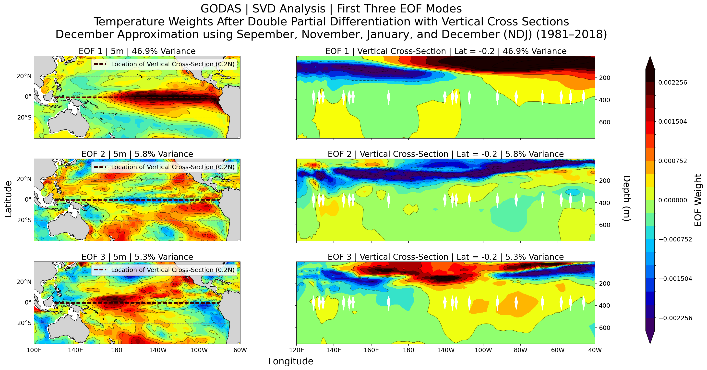
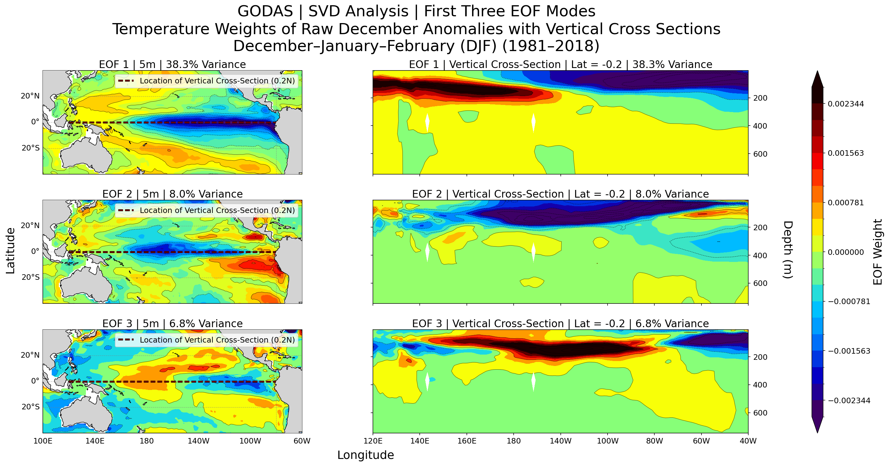

# Double-Partial Gradient Field SVD — ENSO Analysis

**M586 Applied Mathematics Project**  
Matthew T., Arthur P., Ilcia P., Richard P.

---

## Overview

This project applies a data-driven approach to study ENSO (El Niño–Southern Oscillation) variability in the tropical Pacific Ocean. Rather than performing SVD directly on raw anomaly fields, the core idea is to first compute a **mixed partial derivative** of the anomaly field with respect to both the seasonal cycle (month) and interannual time (year), then decompose the resulting gradient field via SVD. This isolates spatial modes that reflect *how boreal-winter variability is itself changing across decades*, rather than the anomaly amplitude alone.




---

## Methodology Summary

### Data

- **Source:** NOAA NCEP Global Ocean Data Assimilation System (GODAS)
- **Variable:** Potential temperature (`pottmp`)
- **Period:** 1980–2019 (40 years of monthly means)
- **Spatial domain:** Tropical Pacific
  - Longitude: $100^\circ\text{E}$ to $300^\circ\text{E}$ (200 grid points)
  - Latitude: $40^\circ\text{S}$ to $40^\circ\text{N}$ (240 grid points at $0.5^\circ$ resolution)
  - Depth: top 30 levels ($5\,\text{m}$ to ${\sim}300\,\text{m}$)
- **Flattened spatial dimension:** $N = 30 \times 200 \times 240 = 1{,}440{,}000$

### Pipeline

$$
\text{GODAS monthly files}
$$

$$
\downarrow
$$

$$
\text{Spatial subset} \quad \bigl(\text{lon} \in [100, 300],\ \text{lat} \in [-40, 40],\ \text{level } 0\text{--}29\bigr)
$$

$$
\downarrow
$$

$$
\text{Climatology} \quad \bar{x}_m = \tfrac{1}{40}\sum_{y=1}^{40} x_{y,m} \in \mathbb{R}^N \qquad \text{shape: } (12,\, N)
$$

$$
\downarrow
$$

$$
\text{Anomaly field} \quad a_{y,m} = x_{y,m} - \bar{x}_m \qquad \text{shape: } (40,\, 12,\, N)
$$

$$
\downarrow
$$

$$
\text{1st derivative: 4th-order centered difference over Oct--Nov--Dec--Jan--Feb}
$$

$$
\delta_m^{(4)} a_{y,\text{Dec}} = \frac{-a_{y,\text{Oct}} + 8\,a_{y,\text{Nov}} - 8\,a_{y,\text{Jan}} + a_{y,\text{Feb}}}{12} \qquad \text{shape: } (40,\, N)
$$

$$
\downarrow
$$

$$
\text{2nd derivative: centered difference across years (interior years 1981--2018)}
$$

$$
b_y = \frac{\delta_m^{(4)} a_{y+1,\text{Dec}} - \delta_m^{(4)} a_{y-1,\text{Dec}}}{2} \qquad \text{shape: } (38,\, N)
$$

$$
\downarrow
$$

$$
\text{SVD input matrix} \quad B = \bigl[\, b_2 \mid b_3 \mid \cdots \mid b_{39} \,\bigr] \in \mathbb{R}^{N \times 38}
$$

$$
\downarrow
$$

$$
\text{Economy SVD via } B^\top B \in \mathbb{R}^{38 \times 38} \quad \text{(eigendecomposition)}
$$

$$
\downarrow
$$

$$
\text{Spatial EOFs } (U),\quad \text{singular values } (\sigma),\quad \text{temporal PCs } (V)
$$

### Why the double partial derivative?

- **First derivative (month direction, 4th-order stencil):** Estimates how the anomaly field evolves through the boreal winter (DJF) season. The 4th-order stencil uses five months of support (Oct, Nov, Dec, Jan, Feb), reducing truncation error relative to a simple 2-point difference and focusing on the season of peak ENSO expression.
- **Second derivative (year direction, 2nd-order):** Measures how that wintertime rate of change itself shifts from year to year — isolating decadal-scale trends in ENSO seasonality rather than raw warm/cold amplitude.

### SVD strategy

Because $N = 1{,}440{,}000 \gg 38$, direct SVD of $B$ is expensive. The analysis instead forms the $38 \times 38$ cross-product matrix $C = B^\top B$, eigendecomposes it (exact, dense), and recovers $U$ from $B$ and the eigenvectors. This is equivalent to the full thin SVD but orders of magnitude cheaper.

---

## Comparison

Results from the double-partial SVD are compared against a **raw December anomaly SVD** (same 1981–2018 period, same $B^\top B$ approach) to assess whether the derivative pre-processing:

- Changes how variance is distributed across modes
- Sharpens or redistributes the leading spatial EOF patterns
- Produces principal component time series with stronger ENSO alignment

ENSO phase labels (El Niño / La Niña / neutral) are overlaid on PC time series to evaluate correspondence with known events.

---

## Repository Contents

| File | Description |
|---|---|
| `Double_Partial_Across_NDJ.ipynb` | Main analysis notebook (proposal, pipeline, SVD, visualizations) |
| `NOAA_data_download.py` | Data download and preprocessing utilities |
| `F3M_NOV+OCT-JAN+FEB.png` | First 3 modes — temporal PCs (double-partial SVD) |
| `F3M_Raw_December_Anomalies.png` | First 4 modes — spatial EOFs (raw December SVD) |
| `M1_NOV+OCT-JAN+FEB.png` | Mode 1 spatial EOF (double-partial SVD) |
| `M1_Raw_December_Anomalies.png` | Mode 1 spatial EOF (raw December SVD) |
| `M1_PC_NO-JF.png` | Mode 1 PC time series (double-partial SVD) |
| `M1_PC_RAW.png` | Mode 1 PC time series (raw December SVD) |
| `PCM_FM_RawVSPartial.png` | Side-by-side cumulative variance comparison |
| `Variance Explained vs Modes.png` | Cumulative and per-mode variance explained |

### Output files (not tracked, generated by notebook)

| File | Description |
|---|---|
| `GODAS_data/` | Raw and combined GODAS NetCDF files |
| `GODAS_Partials_SVD_results_NDJ.nc` | SVD results from the double-partial pipeline ($U$, $\sigma$, $V$, `valid_mask`) |
| `GODAS_Raw_SVD_results_NDJ.nc` | SVD results from raw December anomalies ($U$, $\sigma$, $V$, `valid_mask`) |

---

## Setup

### Dependencies

```
numpy
xarray
scipy
matplotlib
cartopy
dask
requests
urllib3
netcdf4
```

Install with:

```bash
pip install numpy xarray scipy matplotlib cartopy dask requests urllib3 netcdf4
```

### Downloading GODAS data

```python
from pathlib import Path
from NOAA_data_download import _make_session, download_godas

session      = _make_session()
godas_folder = Path("GODAS_data")
download_godas(godas_folder, 2025, session)
```

`download_godas` will skip files that already exist, combine annual files per variable into single NetCDF files (`godas_pottmp.nc`, etc.), and compute monthly climatologies automatically.

---

## Key Mathematical Objects

| Symbol | Shape | Meaning |
|---|---|---|
| $x_{y,m}$ | $\mathbb{R}^N$ | Flattened monthly field for year $y$, month $m$ |
| $\bar{x}_m$ | $\mathbb{R}^N$ | 40-year climatological mean for month $m$ |
| $a_{y,m}$ | $\mathbb{R}^N$ | Anomaly field |
| $\delta_m^{(4)} a_{y,\text{Dec}}$ | $\mathbb{R}^N$ | 4th-order DJF seasonal derivative at December |
| $b_y$ | $\mathbb{R}^N$ | Mixed partial $\partial^2 a / \partial y\,\partial m$ at December, interior year $y$ |
| $B$ | $\mathbb{R}^{N \times 38}$ | SVD input matrix (columns $= b_y$, $y = 1981\text{--}2018$) |
| $U$ | $\mathbb{R}^{N \times 38}$ | Spatial EOFs |
| $\sigma$ | $\mathbb{R}^{38}$ | Singular values |
| $V$ | $\mathbb{R}^{38 \times 38}$ | Temporal principal components |


---

## Detailed Methodology

### Spatial Interpretation

For a **fixed year $y$ and month $m$**, the corresponding monthly mean field is denoted by

$$
X_{y,m}^{\text{full}} \in \mathbb{R}^{40 \times 360 \times 418}
$$

with axes ordered as **(level, longitude, latitude)**.

### Spatial Subset

Before any vectorization or further computation, we note that working with the full $40 \times 360 \times 418 = 6{,}019{,}200$ grid points is computationally expensive and includes large regions that are not directly relevant to tropical Pacific variability. We therefore restrict each monthly field to a physically motivated subdomain defined by the following ranges:

| Dimension | Full size | Subset range | Subset size |
|---|---|---|---|
| Longitude | $360$ ($0^\circ\text{E}$ to $359^\circ\text{E}$) | $100^\circ\text{E}$ to $300^\circ\text{E}$ | $200$ |
| Latitude | $418$ ($74.5^\circ\text{S}$ to $64.5^\circ\text{N}$) | $-40^\circ$ to $40^\circ$ | $240$ |
| Depth (level) | $0$ to $40$ | $0$ to $29$ | $30$ |

The retained $30$ depth levels correspond to the following nominal depths (in meters):

$$
z \in \{5, 15, 25, 35, 45, 55, 65, 75, 85, 95, 105, 115, 125, 135, 145, 155, 165, 175, 185, 195, 205, 215, 225, 238, 262, 303, 366, 459, 584, 747\}
$$

This subsetting captures the upper ocean down to approximately $747\,\text{m}$, encompassing the majority of ENSO-relevant heat variability. The longitude window $[100^\circ\text{E},\ 300^\circ\text{E}]$ spans the Indo-Pacific basin, while the latitude band $[-40^\circ,\ 40^\circ]$ isolates the tropical and subtropical regions where ENSO patterns are the most pronounced.

### Creating the Space-Time Data Matrix

We denote the subsetted field by

$$
X_{y,m} = X_{y,m}^{\text{full}}[0{:}30,\ 100{:}300,\ i_1{:}i_2] \in \mathbb{R}^{30 \times 200 \times 240},
$$

where $i_1$ and $i_2$ correspond to latitudes $-40^\circ$ and $40^\circ$, respectively. Flattening the spatial dimensions yields

$$
x_{y,m} = \operatorname{vec}(X_{y,m}) \in \mathbb{R}^N, \qquad N = 30 \times 200 \times 240 = 1{,}440{,}000.
$$

This reduces the per-field dimensionality by a factor of $\frac{6{,}019{,}200}{1{,}440{,}000} \approx 4.18$, resulting in a substantial reduction in memory usage and computational cost for all subsequent operations.

Fixing a calendar month $m$, across $Y = 40$ years we collect the sequence

$$
x_{1,m},\ x_{2,m},\ \dots,\ x_{Y,m}, \qquad x_{y,m} \in \mathbb{R}^{1{,}440{,}000}.
$$

Arranging these vectors as columns defines the month-specific data matrix

$$
A_m =
\begin{bmatrix}
x_{1,m} & x_{2,m} & \cdots & x_{Y,m}
\end{bmatrix}
\in \mathbb{R}^{1{,}440{,}000 \times Y}.
$$

In this study, $Y = 40$, so $A_m \in \mathbb{R}^{1{,}440{,}000 \times 40}$ and contains $1{,}440{,}000 \times 40 = 57{,}600{,}000$ scalar entries.

### Computing Climatology

For each fixed month $m$, we define the climatological mean vector by

$$
\overline{x}_m = \frac{1}{Y}\sum_{y=1}^{Y} x_{y,m} \in \mathbb{R}^{1{,}440{,}000}.
$$

In this study, $Y = 40$, so $\overline{x}_m$ represents the average spatial field for month $m$ across all years.

### Computing the Anomaly Matrix

For each year $y$ and month $m$, we define the anomaly vector by

$$
a_{y,m} = x_{y,m} - \overline{x}_m \in \mathbb{R}^{1{,}440{,}000}.
$$

Arranging these vectors as columns defines the anomaly matrix for month $m$:

$$
\widetilde{A}_m =
\begin{bmatrix}
a_{1,m} & a_{2,m} & \cdots & a_{Y,m}
\end{bmatrix}
\in \mathbb{R}^{1{,}440{,}000 \times Y}.
$$

In this study, $Y = 40$, so $\widetilde{A}_m \in \mathbb{R}^{1{,}440{,}000 \times 40}$.

### Mixed Partial Derivative Across Months

Treating the anomaly field $a_{y,m} \in \mathbb{R}^N$ as a function of two discrete variables,

$$
a = a(y,m), \qquad y = 1,\dots,Y, \quad m = 1,\dots,12,
$$

we apply successive centered finite difference operators prior to constructing the SVD input matrix. Rather than applying a standard two-point centered difference across all 12 months, we focus on the boreal winter season and use a higher-order stencil. The goal is to estimate the local rate of change of the anomaly field at December using surrounding months (October, November, January, and February).

A fourth-order centered finite difference approximation of $\partial a / \partial m$ at $m = \mathrm{Dec}$ is formulated as

$$
\delta_m^{(4)} a_{y,\mathrm{Dec}}
= \frac{-a_{y,\mathrm{Oct}} + 8\,a_{y,\mathrm{Nov}} - 8\,a_{y,\mathrm{Jan}} + a_{y,\mathrm{Feb}}}{12},
$$

where $\Delta m = 1$ month. The coefficient pattern $(-1,\,8,\,0,\,-8,\,1)$ corresponds to the standard fourth-order centered stencil, with the central value $a_{y,\mathrm{Dec}}$ canceling by symmetry.

Let $f(m)$ denote a scalar component of the anomaly field and expand about $m=0$ (December). Using Taylor series at the surrounding offsets $m = \pm 1$ and $m = \pm 2$ gives

$$
\begin{aligned}
f(\pm 1) &= f(0) \pm f'(0) + \frac{1}{2}f''(0) \pm \frac{1}{6}f^{(3)}(0) + \frac{1}{24}f^{(4)}(0) + \cdots
\end{aligned}
$$

and

$$
\begin{aligned}
f(\pm 2) &= f(0) \pm 2f'(0) + 2f''(0) \pm \frac{4}{3}f^{(3)}(0) + \frac{2}{3}f^{(4)}(0) + \cdots
\end{aligned}
$$

We seek coefficients $c_{-2},c_{-1},c_0,c_1,c_2$ such that $\sum_{k=-2}^{2} c_k f(k)$ approximates $f'(0)$. Using the Taylor expansion

$$
f(k) = f(0) + k f'(0) + \frac{k^2}{2}f''(0) + \frac{k^3}{6}f^{(3)}(0) + \frac{k^4}{24}f^{(4)}(0) + \cdots
$$

and substituting into the linear combination, distributing and grouping like derivative terms gives

$$
\sum_{k=-2}^{2} c_k f(k) =
\left(\sum_{k=-2}^{2} c_k\right) f(0) +
\left(\sum_{k=-2}^{2} k\,c_k\right) f'(0) +
\left(\sum_{k=-2}^{2} \frac{k^2}{2}c_k\right) f''(0) +
\left(\sum_{k=-2}^{2} \frac{k^3}{6}c_k\right) f^{(3)}(0) +
\left(\sum_{k=-2}^{2} \frac{k^4}{24}c_k\right) f^{(4)}(0) + \cdots
$$

To make this expression equal to $f'(0)$ up to higher-order error, we require:

$$
\begin{aligned}
\sum_{k=-2}^{2} c_k &= 0 \quad \text{(cancel constant term)} \\
\sum_{k=-2}^{2} k\,c_k &= 1 \quad \text{(preserve first derivative)} \\
\sum_{k=-2}^{2} k^2 c_k &= 0 \\
\sum_{k=-2}^{2} k^3 c_k &= 0 \\
\sum_{k=-2}^{2} k^4 c_k &= 0
\end{aligned}
\quad \text{(cancel error terms)}
$$

Writing these conditions out explicitly for $k = -2,-1,0,1,2$ gives

$$
\begin{aligned}
c_{-2}+c_{-1}+c_0+c_1+c_2 &= 0,\\
-2c_{-2}-c_{-1}+c_1+2c_2 &= 1,\\
4c_{-2}+c_{-1}+c_1+4c_2 &= 0,\\
-8c_{-2}-c_{-1}+c_1+8c_2 &= 0,\\
16c_{-2}+c_{-1}+c_1+16c_2 &= 0.
\end{aligned}
$$

Solving this linear system yields

$$
(c_{-2},c_{-1},c_0,c_1,c_2)=
\left(\frac{1}{12},\,-\frac{2}{3},\,0,\,\frac{2}{3},\,-\frac{1}{12}\right)
= \left(\frac{1}{12},\,-\frac{8}{12},\,0,\,\frac{8}{12},\,-\frac{1}{12}\right).
$$

Therefore,

$$
f'(0) \approx \frac{f(-2) - 8f(-1) + 8f(1) - f(2)}{12}.
$$

Equivalently, reversing the month orientation gives

$$
f'(0) \approx \frac{-f(-2) + 8f(-1) - 8f(1) + f(2)}{12},
$$

depending on the sign convention adopted for the month coordinate.

### Mixed Partial Derivative Across Years

We now apply a centered finite difference in the year direction to the DJF seasonal derivative field. For each interior year $y \in \{2,\dots,Y-1\}$, define

$$
b_y = \frac{\delta_m^{(4)} a_{y+1,\mathrm{Dec}} - \delta_m^{(4)} a_{y-1,\mathrm{Dec}}}{2} \in \mathbb{R}^N.
$$

This provides a second-order approximation of the mixed partial derivative

$$
\frac{\partial}{\partial y}\left(\frac{\partial a}{\partial m}\right)(y,\mathrm{Dec})
= \frac{\partial^2 a}{\partial y\,\partial m}\bigg|_{m=\mathrm{Dec}},
$$

evaluated at the December center of the DJF window. Substituting the fourth-order stencil and expanding yields

$$
b_y = \frac{
\left(-a_{y+1,\mathrm{Oct}} + 8\,a_{y+1,\mathrm{Nov}} - 8\,a_{y+1,\mathrm{Jan}} + a_{y+1,\mathrm{Feb}}\right) -
\left(-a_{y-1,\mathrm{Oct}} + 8\,a_{y-1,\mathrm{Nov}} - 8\,a_{y-1,\mathrm{Jan}} + a_{y-1,\mathrm{Feb}}\right)
}{24}.
$$

The valid indices are $y \in \{2,\dots,Y-1\}$. In this study, $Y = 40$, yielding $38$ vectors $b_y \in \mathbb{R}^N$.

### Physical Interpretation

The quantity $b_y$ does not measure the anomaly field itself, nor a simple month-to-month or year-to-year change. Instead, it captures how the *seasonal gradient* of the anomaly field changes over time. More precisely:

- $\delta_m^{(4)} a_{y,\mathrm{Dec}}$ measures the local rate of change of the anomaly field through the boreal winter (DJF) window in year $y$,
- $b_y$ measures how this wintertime rate of change itself varies across years.

Equivalently, $b_y$ approximates a discrete mixed partial derivative,

$$
b_y \approx \frac{\partial^2 a}{\partial y\,\partial m}(y,\mathrm{Dec}),
$$

and therefore reflects changes in both the magnitude and direction of seasonal evolution from one year to the next.

Restricting the month derivative to the DJF window focuses the analysis on the season of peak ENSO expression. The fourth-order stencil improves upon the standard two-point scheme by incorporating five months of support, reducing truncation error and providing a more accurate approximation at December by emphasizing the immediately adjacent months (November and January) relative to the outer months (October and February).

### SVD Analysis

Define the mixed-derivative field at each interior year as $b_y \in \mathbb{R}^N$, $N = 1{,}440{,}000$, $y \in \{2,\dots,Y-1\}$. Arranging these vectors as columns defines the data matrix

$$
B =
\begin{bmatrix}
b_2 & b_3 & \cdots & b_{Y-1}
\end{bmatrix}
\in \mathbb{R}^{N \times (Y-2)}.
$$

In this study, $Y = 40$, so $B \in \mathbb{R}^{1{,}440{,}000 \times 38}$.

Directly computing the SVD of $B$ is computationally expensive. Instead, we compute the SVD via the cross-product matrix $B^\top B \in \mathbb{R}^{(Y-2)\times(Y-2)}$, which permits an efficient dense eigendecomposition. Since forming $B B^\top \in \mathbb{R}^{1{,}440{,}000 \times 1{,}440{,}000}$ would be computationally infeasible, we instead form the much smaller $B^\top B \in \mathbb{R}^{38 \times 38}$, which yields the same nonzero singular values. The matrix $C = B^\top B$ is symmetric positive semi-definite; its eigenvalues are the squares of the singular values of $B$ and its eigenvectors are the right singular vectors.

**Step 1: Form the cross-product matrix**

$$
C = B^\top B \in \mathbb{R}^{(Y-2)\times(Y-2)}.
$$

**Step 2: Eigendecompose $C$**

$$
C = V \Lambda V^\top,
$$

where $\Lambda = \operatorname{diag}(\lambda_1, \dots, \lambda_{Y-2})$ with $\lambda_1 \geq \lambda_2 \geq \cdots \geq 0$, and the columns of $V \in \mathbb{R}^{(Y-2)\times(Y-2)}$ are orthonormal eigenvectors.

**Step 3: Recover the singular values**

$$
\sigma_i = \sqrt{\lambda_i}, \qquad i = 1, \dots, Y-2.
$$

**Step 4: Recover the left singular vectors**

For each $i$ with $\sigma_i > 0$, define $u_i = \frac{1}{\sigma_i} B v_i \in \mathbb{R}^N$, where $v_i$ is the $i$-th column of $V$. In matrix form,

$$
U = B V \Sigma^{-1}, \qquad U \in \mathbb{R}^{N \times (Y-2)}.
$$

This yields the thin SVD $B = U \Sigma V^\top$, where the columns of $U$ are spatial EOFs of the mixed-derivative field, the diagonal entries of $\Sigma$ are singular values in descending order, and the columns of $V$ describe temporal evolution across interior years $\{1981,\dots,2018\}$.

### Variance Explained and Low-Rank Reconstruction

The squared singular values $\sigma_i^2$ quantify variance captured by each mode. The variance explained by mode $i$ and the cumulative variance through mode $k$ are

$$
\text{Var}_i = \frac{\sigma_i^2}{\displaystyle\sum_{j=1}^{Y-2} \sigma_j^2}, \qquad
\text{CumVar}_k = \sum_{i=1}^{k} \text{Var}_i.
$$

The rank-$k$ approximation of $B$ is

$$
B_k = \sum_{i=1}^{k} \sigma_i u_i v_i^\top = U_k \Sigma_k V_k^\top,
$$

where $U_k \in \mathbb{R}^{N \times k}$, $\Sigma_k \in \mathbb{R}^{k \times k}$, and $V_k \in \mathbb{R}^{(Y-2)\times k}$ contain the first $k$ singular vectors and values. In this study we focus on the leading $k = 3$ modes:

$$
B_3 = \sum_{i=1}^{3} \sigma_i u_i v_i^\top.
$$

Each rank-one term consists of a spatial pattern $u_i$ (EOF), a temporal coefficient $v_i$, and a scaling factor $\sigma_i$, yielding a low-rank representation of the spatiotemporal structure of the mixed-derivative field.
